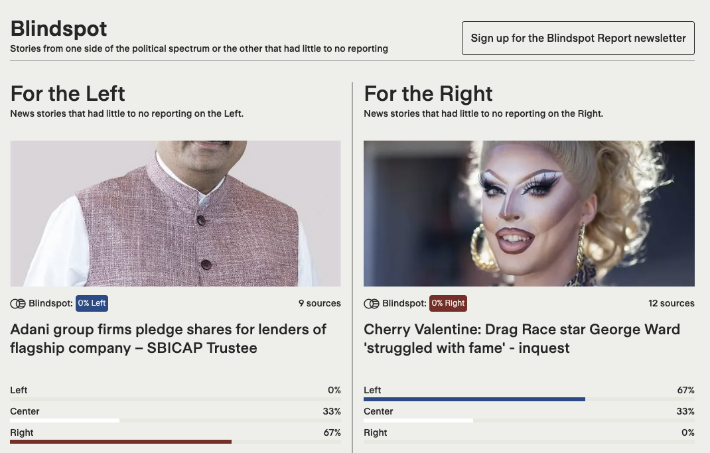

# Bridge the Divide

#### Inspiration

This app is inspired by the insights of Jonathan Haidt's seminal work [The Righteous Mind]('https://www.amazon.co.uk/Righteous-Mind-Divided-Politics-Religion/dp/0141039167') and by Ground News' [Blindspot Report]('https://ground.news/blindspot')

   

### Motivation
---

In today's world, it's easy to become engulfed solely in our own political beliefs and viewpoints. This can lead to a lack of understanding and empathy towards those who hold different political views. With political polarization on the rise, it's becoming increasingly important to strive for greater political literacy and a more nuanced understanding of the issues we face.

This app seeks to challenge and broaden people's perspectives on political issues by presenting them with multiple viewpoints on the same topic. By exposing users to different ways of thinking and reasoning, the app aims to help reduce the effects of confirmation bias and encourage more open-minded and empathetic discussions of political issues.
In a time of political polarization, where the media and social media algorithms tend to reinforce our preexisting beliefs, this app represents an important step towards greater political diversity and a more nuanced understanding of the world.

#### What is confirmation bias?

Confirmation bias is a phenomenon in which people tend to seek out and give more weight to information that supports their existing beliefs and values, while disregarding or downplaying information that contradicts them. This bias can have a significant impact on the way people digest news and media, leading to a distorted and incomplete understanding of the world.

In the context of news and media consumption, confirmation bias can cause people to only seek out sources that align with their political views, rather than exposing themselves to a range of perspectives. This leads to a narrow and limited understanding of the issues, and reinforces existing beliefs without challenging them.

Confirmation bias not only causes people to seek out information that supports their beliefs, but it also makes them less likely to give weight to opposing views. When people have a strong belief in a particular ideology or political viewpoint, they are more likely to reject or dismiss information that contradicts it, even if that information is well-supported and credible.

This tendency to reject opposing viewpoints can create a self-reinforcing cycle, in which people only receive information that supports their views, and they become increasingly convinced that they are right. This makes it difficult for people to have meaningful conversations and debates about political issues, as they are less likely to listen to and consider opposing viewpoints.

#### How does technology confound this issue?

In today's digital age, we are bombarded with a constant stream of information and news. While the Internet has made it easier than ever to access information and connect with people from all over the world, it has also created new challenges when it comes to political diversity and avoiding confirmation bias

The algorithms that drive our online experiences, such as the ones used by social media platforms and search engines, are designed to prioritize content that generates engagement and interaction often to the detriment of diversity and intellectual curiosity. This means that we are often only shown political content that aligns with our beliefs, rather than being exposed to a wider range of perspectives and ideas.

### The Righteous Mind

---

Jonathan Haidt, in his book "The Righteous Mind," argues that human moral reasoning is driven by a set of universal psychological mechanisms, rather than by reason and logic alone. Our moral and political beliefs, therefore, are shaped by a complex interplay of intuition and reasoning,  and are heavily influenced by our emotional reactions to the world around us.

 Haidt uses the metaphor of an elephant and its rider to explain the relationship between our intuitive moral and political beliefs and our conscious reasoning. The elephant represents our intuitive and emotional responses, while the rider represents our conscious reasoning and decision-making abilities.

Haidt argues that the elephant is much larger and stronger than the rider, and that our conscious reasoning serves more as a servant to our intuitive beliefs than as a master. In other words, our conscious reasoning often serves to justify and rationalize the moral and political beliefs that we hold based on our emotions and intuitions

This analogy highlights the importance of being open to new perspectives and ideas, especially when it comes to political issues. By exposing ourselves to different viewpoints, we can help guide our intuitive elephants in new and unfamiliar directions, and by doing so, broaden our perspectives and gain a deeper understanding of the world

Haidt also develops morals -- go to this link to do test

### The Goal of this App

---

The key to breaking out of the echo chambers of our own political beliefs lies in being open-minded and curious about the perspectives of others. By presenting multiple viewpoints on the same political issue, this app provides an opportunity for users to broaden their horizons and gain a deeper understanding of the complexities of the issues at hand.

But it's important to remember that simply being exposed to different viewpoints is not enough. To truly benefit from this experience, users must approach the articles with an open mind and a willingness to engage with the ideas and arguments presented by the authors. This may mean setting aside one's preconceptions and considering the possibility that other perspectives might be just as valid and worthy of respect as one's own.

By embracing this spirit of openness and curiosity, users can turn the experience of using this app into a transformative one. They will gain a new appreciation for the diversity of political views and the richness of human experience, and will emerge from the experience with a more nuanced and empathetic understanding of the world.

So in using this app, I encourage you to be like the rider, who guides the elephant with grace and intelligence. Take control of your intuition and use your conscious reasoning to navigate the diverse political landscape, allowing yourself to be challenged and informed by the perspectives of others. The journey may be difficult, but the destination will be a more informed and empathetic understanding of the world.

### Details of the App (include image)

---

For a more technical explanation please visit this [link]('google.com')

The app is primarily a multiple source UK news aggregator with a selection of sources being selected 

My app aggregates news stories from various UK media outlets that span a range of political ideologies. Some of these media outlets may be considered conservative or right-leaning, while others may be liberal or left-leaning. To classify the general political stance of each media outlet I used the [study]('https://yougov.co.uk/topics/politics/articles-reports/2017/03/07/how-left-or-right-wing-are-uks-newspapers') done by YouGov. Here is a look at their classification 

I began by scraping the articles on contentious topics from the websites at the edge of each side (The Guardian & The Daily Mail) and the most neutral (The Independent). 

With the aim of providing the most up-to-date information on controversial topics, the app scrapes ten of the latest articles for each news outlet on a daily basis. Users can easily access this information by selecting a topic of interest.

Once a topic has been selected, I encourages users to broaden their perspectives by exploring articles that represent a range of different political opinions. 

This feature is intended to be used as a way to engage with opposing viewpoints in an open-minded manner to gain a more nuanced and well-rounded understanding of each issue.

### Future Roadmap

